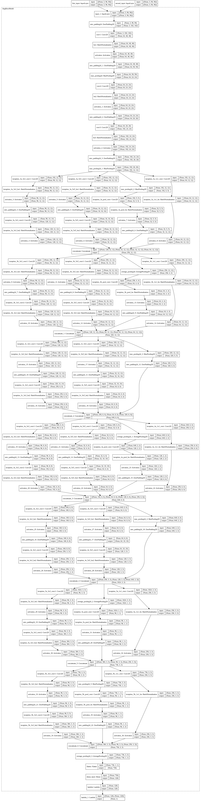

# Siamese-Network-Fingerprint

This is my last sem project of my graduation. In this project, I used [SOCOFing data](https://www.kaggle.com/ruizgara/socofing). This dataset contains fingerprint of 6000 subjects with their fingerprint in different-different positions. I trained a siamese network to minimize euclidean-distance between anchor image and positive image and maximize the euclidean-distance between anchor image and negative image.

## Model
The network structure is as follows:

## Loss
To train the model I used **contrastive loss** in which you tell the model that these datas are near to each other and these datas are not near to each other based on the *y_true* label you provided.
You can check the loss function code in the notebook provided.

And, I also uploaded the trained model. If you want then you could download the trained model.

**Note**:- I also integrated this model with django website which code i will provide later as I am currently working on that django site.
